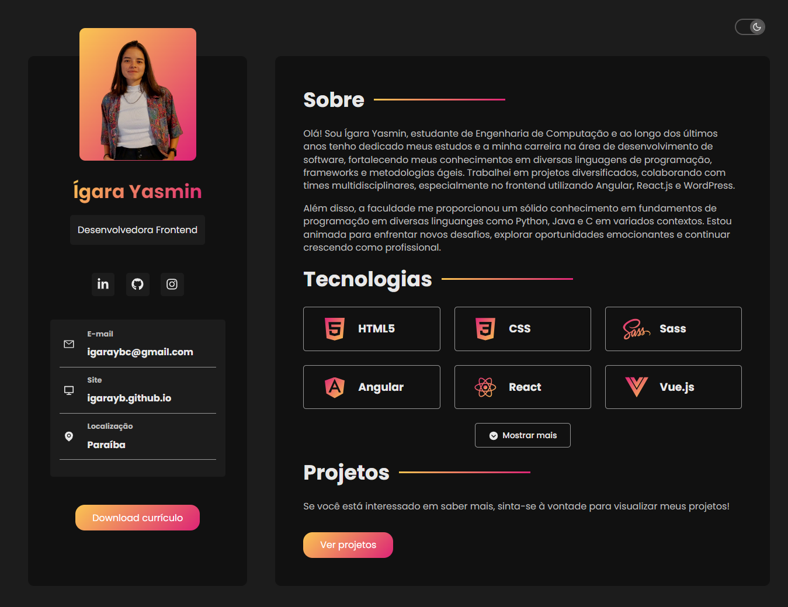
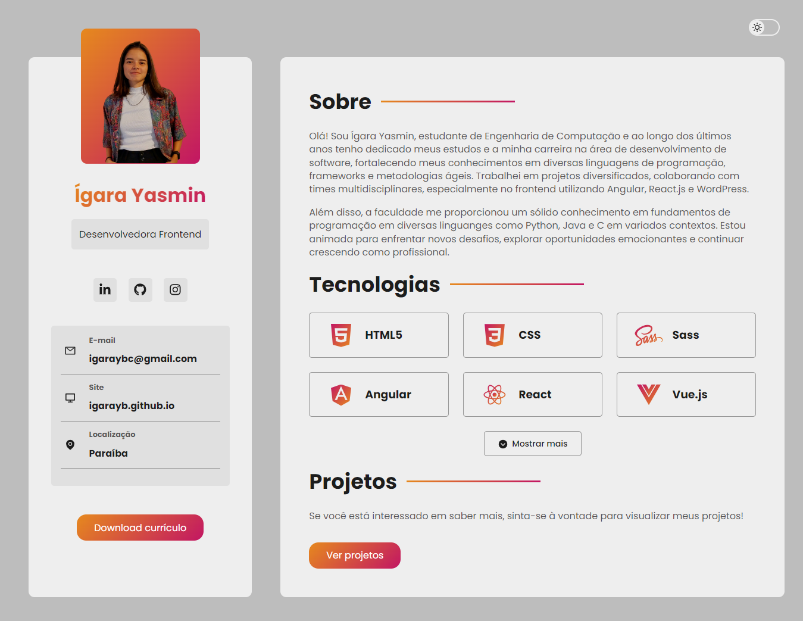

# React and Sass Project

This repository hosts a portfolio project built with React and Sass, designed to practice and showcase my skills in web development. With this project, I had experience with two powerful technologies while creating a web portfolio to highlight some of my work and achievements.

### Inspirational Source and Project Enhancements: 
The inspiration for this project originated from a captivating YouTube video, which can be found [here](https://www.youtube.com/watch?v=5h4vMtBlQQU). Although the core concept and structure were taken from this source, some modifications were implemented to improve the design. One example is that the interface changed to align with my vision, providing a unique visual identity. In addition, a theme switching feature was implemented.

## Screenshots:
### Dark theme:



### Light theme:



### Getting started: 

To get started with this project, ensure you have Node.js and npm installed on your machine. You can clone this repository and then follow these steps:

1. Install project dependencies:
```
npm install
```
2. Start the development server:
```
npm start
```

This will launch your project locally, allowing you to make changes and see the results in real-time.
